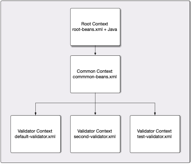

# Metadata Validator Web Service

A micro-service to perform SAML metadata validation.

Built using:

* OpenAPI 2 and Swagger
* Shibboleth Metadata Aggregator
* Spring Boot

## Spring Contexts

The Spring application contexts in the application are arranged as follows:

The root `ApplicationContext` in the application is the one provided by Spring
Boot. This is primarily configured using Java and annotations, but the
classpath resource `root-beans.xml` is also loaded into this context. This
provides some convenience when importing XML configuration from other uses of
the Shibboleth component framework.

The classpath resource `common-beans.xml` is used to configure a
`ClassPathXmlApplicationContext` which takes the root context as its
parent. The `common-beans.xml` context should be used to provide any
beans which will be useful in all validators, so that they don't end up
with a lot of duplication.

Each validator lives in a `ClassPathXmlApplicationContext` of its own.
These are loaded from classpath resources named in the property
`validator.configurations`. The validator contexts are given the
`common-beans.xml` context as their parent.

Each validator context must have the following beans:

* A `String` bean called `id`, which becomes the unique identifier for the
  validator.

* A `String` bean called `description`, which provides a description for the
  validator for use at the `/validators` endpoint.

* A `Pipeline<Element>` bean called `pipeline`, which is the metadata aggregator
  pipeline to execute to perform validation.

* A unnamed `IdentifiableBeanPostProcessor` bean which takes care of copying
  Spring bean `id` attributes into the corresponding Shibboleth component `id`
  if the latter is not supplied. Note that this behaviour only applies for beans
  in the same context as the `IdentifiableBeanPostProcessor` bean and is not
  inherited from the `common-beans.xml` context.

## Dependency Versions and Compatibility

The Java, Shibboleth and MDA domains are all in flux at present, and this project
needs to tread a fine line between their conflicting requirements in order to be
functional. I'm sure this will all resolve in a couple of years, but for now
here's a summary of the current choices.

This project makes use of the Swagger code generator. The current templates used by
that system assume the `javax` rather than `jakarta` namespaces for Java EE APIs
and we therefore use the Shibboleth Java 11 platform parent POM rather than the
Shibboleth java 17 platform parent POM even though the MDA we are using references
the latter. However, this project both explicitly compiles with Java 17 and targets
Java 17 as an execution environment.

The tests for this project make use of some of Spring Boot's 2's testing infrastructure.
That explicitly references an SLF4J implementation class which no longer exists in the
latest versions; this code therefore overrides the Shibboleth parent POM's logging
system versioning in order to make use of the older version which is compatible with
Spring Boot 2.

## Copyright and License

The entire package is Copyright (C) 2018, Ian A. Young.

Licensed under the Apache License, Version 2.0.
